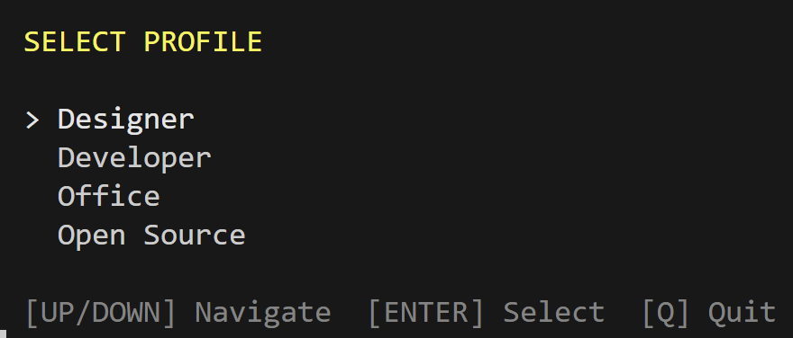
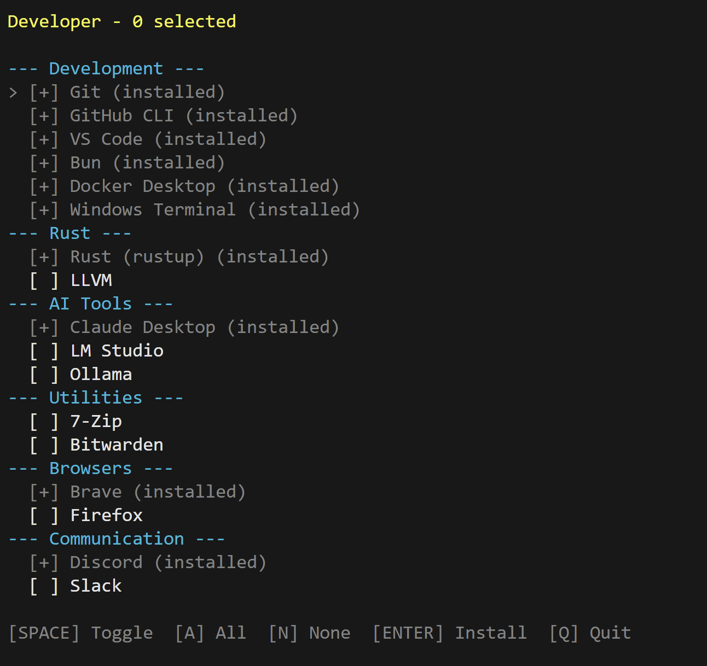

# Winget UI

A simple PowerShell-based TUI (Terminal User Interface) for batch installing Windows packages via winget.

## Features

- Profile-based package management (Developer, Designer, Office)
- Interactive keyboard navigation
- Automatic detection of already installed packages
- Batch installation with progress feedback
- Customizable package groups via JSON configuration
- Security warnings for community-sourced packages
- Detailed error messages on installation failures

## Usage

```powershell
# Interactive mode (profile selection)
.\work.ps1

# Direct mode with specific config
.\work.ps1 --config dev.json
.\work.ps1 --config office.json
```





### Controls

**Profile Selection:**
- `UP/DOWN` - Navigate profiles
- `ENTER` - Select profile
- `Q` - Quit

**Package Selection:**
- `UP/DOWN` - Navigate packages
- `SPACE` - Toggle selection
- `A` - Select all available packages
- `N` - Deselect all
- `ENTER` - Install selected packages
- `Q` - Quit

## Configuration

Profiles are stored as JSON files in the `configs/` folder or in the script directory.

### Profile Structure

```json
{
  "name": "Profile Name",
  "description": "Profile description",
  "packageGroups": {
    "Group Name": [
      { "Name": "Display Name", "Id": "winget.package.id", "Selected": true }
    ]
  }
}
```

### Available Profiles

| Profile | Description |
|---------|-------------|
| Developer | Git, VS Code, Docker, Rust, AI tools, dev utilities |
| Designer | Figma, Adobe CC, OBS, media editing, design tools |
| Office | Microsoft 365, browsers, communication, productivity |

## Creating Custom Profiles

1. Create a new `.json` file in the `configs/` folder
2. Follow the profile structure above
3. Use `winget search <package>` to find package IDs

## Security

- Packages from community sources (non-Microsoft Store) display a warning
- You can cancel installation after reviewing the warning
- Error messages are displayed if installation fails

## Requirements

- Windows 10/11
- PowerShell 5.1+
- [winget](https://github.com/microsoft/winget-cli) (Windows Package Manager)

## License

MIT
